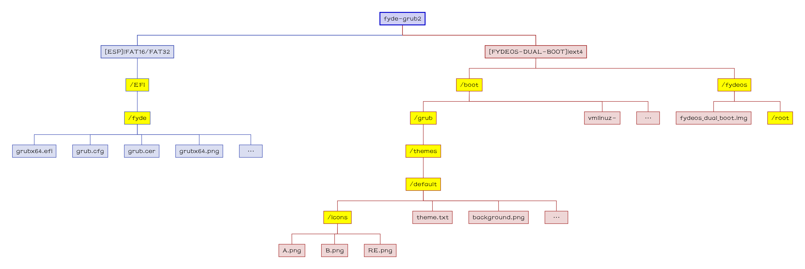

[English](README.md)|[简体中文](自述文件.md)|[繁體中文](繁體中文.md)|...
--|--|--|--

# fyde-grub2
这个是用来启动 fydeOS 的，添加了改编自 [brunch](https://github.com/sebanc/brunch) 的 grub 主题。
#### 文件结构树状图

## 💻️预览👀

🖱️点击展开查看🖱️

## 🧭指南⬇️

### 复制到 ESP
- 复制文件夹 `zip: ESP/EFI/fyde` 到 `ESP: \EFI`；

### 复制到 ext4
- 复制文件夹 `zip: ext4/boot/grub` 到 `FYDEOS-DUAL-BOOT: /boot`；

## 📝FAQ❓️
### 安全启动
- 我还没试过，但可能支持安全启动，如果你使用 `grub.cer`(安全启动证书)，
- - `grub.cer`(安全启动证书) 来自 [Ventoy](https://github.com/ventoy/Ventoy)；
### 启动入口菜单
- 我已经改编了 `grub.cfg` 使得那三个启动入口都变成通用的了，所以无论 `FYDEOS-DUAL-BOOT` 是哪个分区都能够启动。

## ⭐收藏🌟
如果你喜欢并且期待未来的更新，你可以点亮星星。💫

## 🎉来源🎊
- 绝大多数改编自 [Brunch Framework](https://github.com/sebanc/brunch);
- 安全证书来自 [Ventoy](https://github.com/ventoy/Ventoy);
- ...
